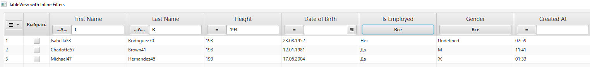

Эта библиотека содержит javafx-таблицу с фильтрами.

# Пример использования
```java
// создание колонок, можете создавать их как вам удобно.
TableColumn<Person, String> firstNameCol = createTableColumn("First Name", Person::firstNameProperty);
TableColumn<Person, String> lastNameCol = createTableColumn("Last Name", Person::lastNameProperty);
TableColumn<Person, Number> heightCol = createTableColumn("Height", Person::heightProperty);

TableColumn<Person, LocalDate> dateOfBirthCol = createTableColumn("Date of Birth", Person::dateOfBirthProperty);
dateOfBirthCol.setCellFactory(CellFactoryBuilder.builder()
        .type(ColumnType.DATE)
        .copyContextMenu()
        .build());

TableColumn<Person, Boolean> isEmployedCol = createTableColumn("Is Employed", Person::isEmployedProperty);
isEmployedCol.setCellFactory(CellFactoryBuilder.builder()
        .type(ColumnType.BOOL)
        .copyContextMenu()
        .build());
TableColumn<Person, String> genderCol = createTableColumn("Gender", Person::genderProperty);

TableColumn<Person, LocalTime> createdAtCol = createTableColumn("Created At", Person::createdAtProperty);
createdAtCol.setCellFactory(CellFactoryBuilder.builder()
        .type(ColumnType.TIME)
        .build());

// создание таблицы
var tableView = new AdvancedTableView<Person>();
tableView.addColumn(firstNameCol, ColumnType.STRING);
tableView.addColumn(lastNameCol, ColumnType.STRING);
tableView.addColumn(heightCol, ColumnType.NUMBER);
tableView.addColumn(dateOfBirthCol, ColumnType.DATE);
tableView.addColumn(isEmployedCol, ColumnType.BOOL);
// Можно создать фильтры под enum-колонку, передав в специальный параметр мапы возможные значения
tableView.addColumn(genderCol, ColumnType.ENUM, Map.of(ENUM_FILTER_TYPES, List.of("М", "Ж", "Undefined")));
tableView.addColumn(createdAtCol, ColumnType.TIME);
// включить автонумерация строк
tableView.enableRowNumColumn(true);
// включить множественный выбор
tableView.enableMultiSelect(true);

tableView.setData(data);
```
# Внешний вид
Код выше создаст такую таблицу с фильтрами. В зависимости от типа колонки будет созданы специальные фильтры.


Таблица совместима с JavaFX TableView, поэтому ее можно расширять по своему усмотрению.
